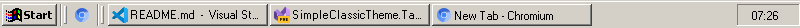

[Simple Classic Theme](https://github.com/WinClassic/SimpleClassicTheme) • **[Taskbar](https://github.com/WinClassic/SimpleClassicTheme.Taskbar)** • [Explorer](https://github.com/WinClassic/SimpleClassicTheme.Explorer) • [Control Panel](https://github.com/WinClassic/SimpleClassicTheme.ControlPanel)

# Simple Classic Theme Taskbar

A classic taskbar alternative. 

For more info check <a href="http://winclassic.boards.net/thread/520/wip-simple-classic-theme-taskbar">the thread on the WinClassic Boards</a>.

## Screenshots

#### Classic

#### Visual Style
